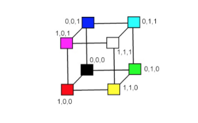
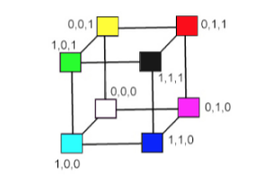
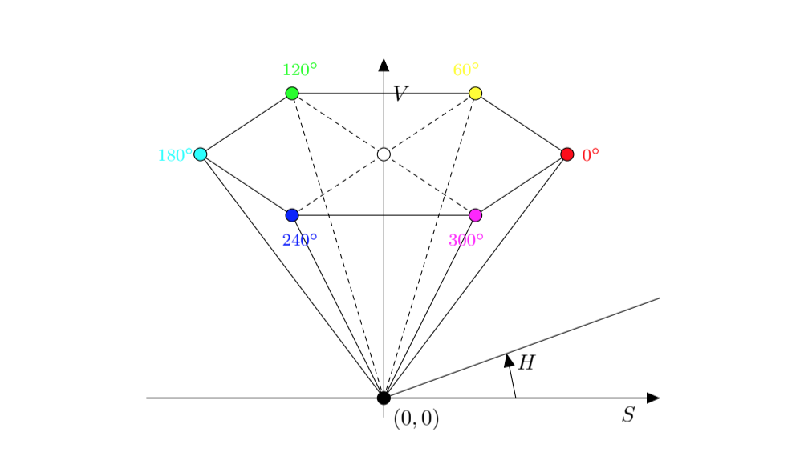

# Elementy Grafiki Komputerowej

1. [Modele barw.](#modele-barw)
2. [Metody kompresji obrazów.](#metody-kompresji-obrazów)
3. [Formaty plików graficznych.](#formaty-plików-graficznych)
4. [Rzutowanie.](#rzutowanie)
5. Rendering.
6. Rasteryzacja, algorytmy rysowania prymitywów graficznych (w szczególności algorytm rysowania odcinka),  antyaliasing. 
7. Generowanie sceny przy pomocy “śledzenia promieni”. 
8. Algorytmy eliminowania powierzchni zasłoniętych.
9. Modele oświetlenia. 
10 Materiały, tekstury.

## Modele Barw

- Model barw jest to określony trójwymiarowy system współrzędnych
barw wraz z widzialnym podzbiorem, w którym leżą wszystkie barwy
z określonej gamy barw.
- Model barw ma umożliwiać wygodny wybór barw wewnątrz jakiejś
gamy barw.

### RGB
- Stanowi najpopularniejszą reprezentację barw.
- Oparty na trójchromatycznej teorii percepcji barw.
- Barwy podstawowe R, G, B są __mieszane addytywnie__, tzn. indywidualne udziały każdej barwy podstawowej są sumowane (mieszane) w celu uzyskania wyniku.

##### Reprezentacja Graficzna

- Bryła modelu RGB jest sześcianem o boku 1. W wierzchołkach tego sześcianu znajdują się barwy podstawowe: 
  - czerwona (1, 0, 0), 
  - zielona (0, 1, 0), 
  - niebieska (0, 0, 1), 
- barwy dopełniające: 
  - żółta (1, 1, 0), 
  - cyjan (0, 1, 1), 
  - magenta (1, 0, 1),
  - biała (1, 1, 1),
  - czarna (0, 0, 0). 
  
- Główna przekątna sześcianu (łącząca wierzchołek barwy czarnej i białej), z równym udziałem barwy podstawowej, reprezentuje poziomy szarości.

##### Wady i Zalety

Zalety:
- wygoda i szybkość obliczeń barw,
- odpowiada sposobom generowania barw na takich urządzeniach jak monitor i telewizor.

Wady:
- percepcyjna niejednorodność, tzn. słabe korelacje pomiędzy postrzeganą różnicą dwóch barw a ich euklidesową odległością w sześcianie RGB,
- nieintuicyjność posługiwania się składowymi, R, G, B w określaniu barwy – problem z wizualizacją barwy na podstawie znajomości składowych RGB,
- wrażliwość wartości składowych na zmiany poziomu oświetlenia (iluminacji) sceny,
- jednoczesne operacje wykonywane na wszystkich składowych mogą prowadzić do przekłamania kolorów (np. rozjaśnienie obrazu RGB wymaga ingerencji we wszystkie składowe obrazu).

### CMY

- Barwy cyjan, magenta i żółta są barwami dopełniającymi odpowiednio dla barw: czerwonej, zielonej, niebieskiej.
- Podstawowe barwy subtraktywne to barwy filtrów używanych w celu odjęcia barwy od barwy światła białego.

##### Reprezentacja Graficzna

- Model CMY jest tak samo reprezentowany w układzie współrzędnych jak model RGB z tą różnicą, że barwa biała (pełne światło) znajduje się w początku układu współrzędnych (a nie barwa czarna - brak światła). Barwy są określane przez to co zostało usunięte albo odjęte od światła białego, a nie przez to co zostało dodane do czerni.

### CMYK

- Model CMYK używa dodatkowo czwartej barwy - barwy czarnej (K).
- Jest używany w czterobarwnych urządzeniach drukarskich wykorzystujących proces czterobarwny i w niektórych urządzeniach tworzących trwałe kopie.
- Dla danej specyfikacji CMY barwa czarna jest używana zamiast równych wartości C, M, Y.

### YUV / YIQ

- Modele te wykorzystuje się do kodowania barw w transmisji sygnału TV (analogowego), kodowania PAL, SECAM oraz NTSC.
- Modele YUV (Europa) oraz YIQ (USA, Kanada, Japonia) niezależnie opisują składowe luminacji oraz chrominancji barwy. Barwa jest reprezentowana w formacie: chrominancja-luminacja.
- Reprezentują barwę w formacie: chrominancja-luminacja. Chrominancja - składowa analogowego lub cyfrowego sygnału obrazu kolorowego odpowiadająca za odcień oraz nasycenie koloru.
- Składowa Y oznacza luminancję. Jest zdefiniowana tak, żeby odpowiadała składowej podstawowej Y w modelu CIE. Składowa Y stanowi czarno-białą treść obrazu kolorowego.
- Składowe UV oraz IQ są tzw. sygnałami różnicowymi i niosą informacje o barwie (chrominancja).
- W modelach YUV i YIQ wykorzystuje się dwie użyteczne właściwości systemu wzrokowego:
  - system jest bardziej czuły na zmiany luminancji niż na zmiany odcienia barwy albo nasycenia, tzn. że człowiek ma mniejszą zdolność do przestrzennego dyskryminowania informacji barwnej niż zdolność do przestrzennego dyskryminowania informacji monochromatycznej. A zatem do reprezentacji wartości Y, aby uzyskać większą rozdzielczość dla Y, powinna być używana większa liczba bitów pasma niż do reprezentowania i oraz Q.
  - detale obrazu, wytwarzają ograniczone wrażenia barwne, dlatego wystarczy, aby je określać za pomocą jednego a nie dwóch parametrów barwy, czyli albo i albo Q mogą mieć mniejsze pasmo.

### HSV

- Model HSV (odcień barwy, nasycenie i wartość) został zaproponowany w 1978 roku przez Alveya Raya Smitha.
- Jest zorientowany na użytkownika i wykorzystuje intuicyjne wrażenia modelu artysty a więc tinty, tony i cienie.

##### Reprezentacja Graficzna

- Model HSV jest reprezentowany w cylindrycznym układzie współrzędnych jako ostrosłup sześciokątny, którego podstawa ma wartość V = 1.
- W podstawie ostrosłupa zawarte są wszystkie względnie jasne barwy, ale nie wszystkie barwy w płaszczyźnie podstawy ostrosłupa mają taką samą percepcyjnie jasność.

## Metody Kompresji Obrazów

- Zmniejszenie głębi barw (kodowanie koloru)
- Zmniejszenie rozdzielczości (podmiana kilku pikseli na jeden o uśrednionym kolorze)
- W sumie to nie ma tego zbyt wiele...

## Formaty Plików Graficznych

#### Grafika Rastrowa 

- JPEG
- TIFF
- PNG
- BMP
- ...

#### Grafika Wektorowa

- PDF
- SVG
- SWF
- EPS
- ...

#### Pliki CAD

- DWG
- DGN
- STL
- ...

## Rzutowanie

- Rzutowanie polega na przekształceniu punktów w n wymiarowej przestrzeni na punkty w n − 1 wymiarowej przestrzeni.
- W grafice komputerowej wykorzystuje się rzutowanie z przestrzeni 3-wymiarowej do przestrzeni 2-wymiarowej.
- Planarne rzuty geometryczne (rzuty) można podzielić na dwie podstawowe klasy:
  - rzuty równoległe
  - rzuty perspektywiczne
  
### Rzutowanie Perspektywiczne

- W rzutowaniu perspektywicznym odległość między środkiem rzutowania a płaszczyzną rzutowania jest skończona.
- Rzuty perspektywiczne dzielimy ze względu na liczbę podstawowych punktów zbieżności, a tym samym ze względu na liczbę osi przecinanych przez rzutnię.

### Rzutowanie Równoległe

- W rzutowaniu równoległym odległość między środkiem rzutowania a płaszczyzną rzutowania zbiega do nieskończoności.
- Skoro środek rzutowania znajduje się w nieskończoności, więc promienie rzutujące są do siebie równoległe i mają ten sam kierunek k.

#### Podział Rzutów Równoległych

##### Rzuty ortogonalne

- Kierunek rzutowania jest prostopadły do rzutni
- Umożliwiają mierzenie odległości i kątów
- Najbardziej popularne: 
  - przedni, 
  - górny, 
  - boczny
- Aksonometryczne rzuty ortogonalne
  - Przypominają rzut perspektywiczny, różnica polega na tym, że skrót jest równomierny, a nie jest związany z odległością od środka rzutu.
  - Równoległość linii jest zachowana, ale równość kątów nie jest zachowana, a odległości mogą być mierzone wzdłuż każdej głównej osi.
  - Rzuty izometryczne
    - normalna do rzutni tworzy równe kąty z głównymi osiami,
    - wszystkie trzy podstawowe osie są jednakowo skrócone, dzięki temu można wykonywać pomiary wzdłuż osi w tej samej skali,
    - kąty między rzutami głównych osi są takie same i wynoszą 120 stopni

##### Rzuty ukośne

- Normalna do rzutni i kierunek rzutowania różnią się
- Łączą właściwości rzutów prostokątnych czołowego, górnego i bocznego z właściwościami rzutu aksonometrycznego:
  - rzutnia jest prostopadła do głównej osi,
  - jeśli rzutujemy obiekt znajdujący się na płaszczyźnie równoległej do rzutni, to można wykonywać pomiary kątów i odległości,
  - jeśli rzutujemy obiekt znajdujący się na płaszczyźnie, która nie jest równoległa do rzutni, to można wykonywać pomiary odległości wzdłuż głównych osi.
  
##### Różnice

Perspektywiczny:
- sprawia wrażenie realistycznego,
- zmienia relacje odległości,
- brak szczególnych zastosowań do rejestrowania dokładnego kształtu i pomiarów obiektów.

Równoległy:
- daje obraz mniej realistyczny,
- zachowuje równoległość prostych,
- zachowuje stosunek długości odcinków równoległych,
- zachowuje związki miarowe figury płaskiej równoległej do płaszczyzny rzutowania,
- stosuje się go głównie w rysunku technicznym.